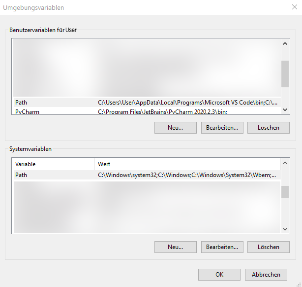
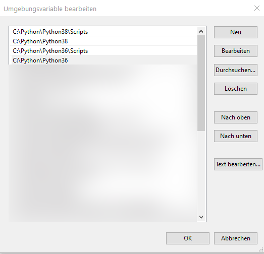
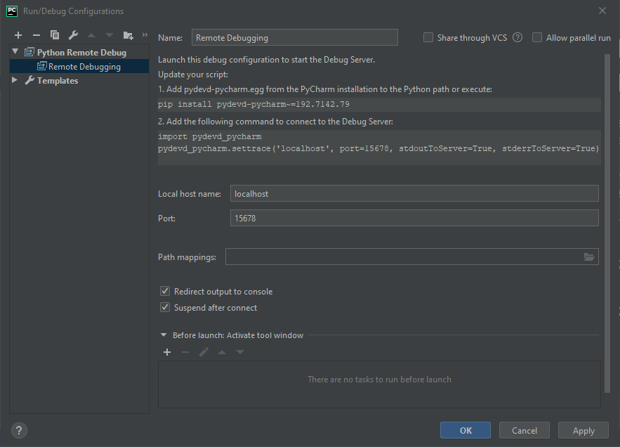

# How to debug in a Keyshot scripting environment

Nothing goes about a nice debugging experience during bug hunting. So this rather seems to be a standard problem. Even Keyshot uses an embedded Python this seems just a normal case for Remote Debugging. But nope, it isn't. But this is still classified as a standard problem, so there are many ways to find a working solution for this issue. The following table lists different ways I tried and the results:

|IDE                |Version    |Result|
|:------------------|:---------:|:-----|
|PyCharm (Pro)      |2019.2.6   |Breaking in to the debugger will result in a file "\<currert_working_dir>/\<string> "not found" exception, so no Breakpoints will be hitted, but the script finishes without errors.|
|PyCharm (Pro)      |2020.2.3   |Connecting to the debugger will block the main thread forever. So you have to kill Keyshot.|
|Visual Stuio       |2019       |Using mixed mode debugging, still results in not hitting any Breaktpoints (No Debugging Symbols found for script), but the script finishes without errors.|
|VS Code/pydebug    |1.51       |During waiting for the debugger to attach pydebug starts a subprocess which results in starting a new Keyshot and Python instance, so it's a complete failure.|
|WingIDE            |7.2        |Even there is a [explicit guide for attaching the debugger to a embeded Python environment](https://wingware.com/doc/debug/debugging-embedded-code). Still no breakpoints will be hitted, but the script finishes without errors.|
|Eclipse+pydev      |-          |Not tested, also relies on pure pydevd like PyCharm, so may worth trying if PyCharm Professional is not available|

There is at least a common pattern here, which hints at a problem with the path mappings, even there isn't a real remote. So taking a look into Pydevd which all (except Wing IDE?) rely on. The best bet here was PyCharm 2019.2.6 because it uses a pure implementation of Pydevd, which is not that hard to understand and to patch. Some fiddling around later the point where Pydevd transmits the filepath to the server of PyCharm was identified. So applying a little patch into Pydevd made things work finally.

## How to get things working

This guide is based on Keyshot 9.3 and Windows (but this should work on other OSs too).

1. Make sure you have Python 3.8 installed or [which version your Keyshot requires](https://luxion.atlassian.net/wiki/spaces/K9M/pages/1062446718/Scripting).
2. Make sure this version is the version used by Keyshot adding this to your PATH environment variable/s and by checking:

```` cmd
python --version
````
There are multiple ways to setting up environment variables in Windows. The following pictures show it through editing the system or user environment variables in the system control panel.

|Editing the System/User environment variables|Editing the Path environment variable|
|:-------------------------------------------:|:-----------------------------------:|
|                 |         |

If you're not that familiar with environment variables, user variables append/overwrite system variables. Otherwise you can obviously set the variables through your preferred command line interface. 

3. Setup a remote debugging configuration in [PyCharm](https://www.jetbrains.com/help/pycharm/creating-and-editing-run-debug-configurations.html#services-tool-window). In the following image you see an example for the required remote debugging configuration, like the one found in this repositories PyCharm project. For details on remote debugging see [Docs](https://www.jetbrains.com/help/pycharm/remote-debugging-with-product.html#remote-interpreter).

|Pycharm remote debugging configuration exmaple|
|:--------------------------------------------:|
||

4. After installing pydevd_pycharm replace pydevd.py with the [patched version](/.patches/site-packages/pydevd.py). See your site-packages directory of your python distribution.
5. Then just add the following to the top of your script additionally, to connect to the debugging server:

````python
import sys, os
import pydevd # You should import pydevd directly, not pydevd_pycharm (see the module why this make sense)

root = os.path.dirname(__file__)
sys.path.append(root)
os.chdir(root)

pydevd.mapping_patches = {"<string>": os.path.basename(__file__)}

pydevd.settrace('localhost', port=15678, stdoutToServer=True, stderrToServer=True, suspend=True)

try:

    # Main

except Exception as e:
    print(e)
finally:
    pydevd.stoptrace()
````

   - Running the script and the PyCharm remote debugging server is not available results in an exception.
   - "suspend" ensures the debugger works probably and stops at calling "settrace". As a result of setting it to False breakpoints may won't hit everytime...
   - You should make sure the script disconnects from the PyCharm debugging server when exits. So use "try" and "finally" to ensure this. Otherwise rerunning the script will may not hit breakpoints anymore.

6. Start the remote debugging server in PyCharm and run the script to debug in Keyshot. Now the breakpoints should be hitted.

## Still known Issues
This works kind of Debugging about 80% of the times you try debugging, in the other cases the script runs without hitting Breakpoints. But when it does not hit any Breakpoints it will show this behaviour likely multiple times. Things like restarting the debugging server, closing and reopening the Scripting Window in Keyshot seem to help here.

